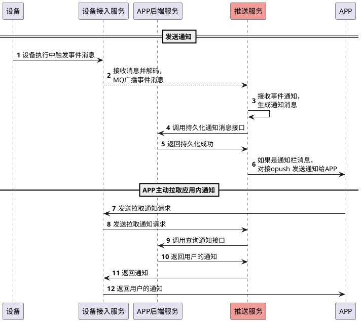

# java-demos
java learning demo

```puml
@startuml

participant 设备 as device
participant 设备接入服务 as a_acc
participant APP后端服务 as a_biz
participant 推送服务 as push #F19C99
participant APP as app

autonumber

==发送通知==

device -> a_acc: 设备执行中触发事件消息
a_acc --> push: 接收消息并解码，\nMQ广播事件消息
push -> push: 接收事件通知，\n生成通知消息
push ->a_biz: 调用持久化通知消息接口
a_biz -> push: 返回持久化成功
push -> app: 如果是通知栏消息，\n对接opush 发送通知给APP

==APP主动拉取应用内通知==

app -> a_acc: 发送拉取通知请求
a_acc -> push: 发送拉取通知请求
push -> a_biz: 调用查询通知接口
a_biz -> push: 返回用户的通知
push -> a_acc: 返回通知
a_acc -> app: 返回用户的通知
@enduml
```
